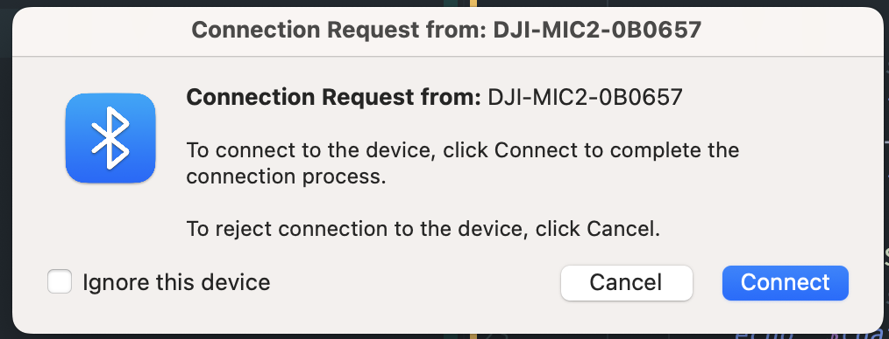

# Auto-Unpair DJI Mic 2 on macOS

Automatically unpair DJI Mic 2 from Mac when it disconnects.

## Install Required Tools

```bash
brew install blueutil
```

## Make the Script Executable

```bash
chmod +x ./unpair_dji_mic.sh
chmod +x ./unpair_dji_mic_v2.sh
```

> Use `blueutil --paired` to find the Mac address for the first time.

## How to Use

### Option 1: Run Automatically at Startup (Recommended)

Install the service to run automatically in the background:

```bash
./setup.sh install
```

This will:
- Install the service to run automatically at system startup
- Start it immediately
- Create log files for monitoring
- Keep running even if it crashes (auto-restart)

**Manage the service:**
```bash
./setup.sh status    # Check if running and view logs
./setup.sh stop      # Stop the service
./setup.sh start     # Start the service
./setup.sh restart   # Restart the service
./setup.sh logs      # View recent logs
./setup.sh uninstall # Remove completely
```

### Option 2: Manual Run

Run the script manually in the background:

```bash
./unpair_dji_mic_v2.sh &
```

> **Note**: The service uses `unpair_dji_mic_v2.sh` which includes proper PATH setup for Homebrew. The original `unpair_dji_mic.sh` is kept for reference.

## How It Works

* The script monitors the DJI Mic 2 connection status every 5 seconds
* If the DJI Mic 2 is paired and disconnected, it will automatically unpair it
* To pair it again, you need to do it manually from the Bluetooth settings
* On the transmitter, press and hold the power button for 3 seconds to turn it on and then press and hold the Link button for 3 seconds to enter pairing mode
* To disconnect, simply turn off the transmitter
* Within 5 seconds of disconnecting, the script will unpair it

## Log Files

When running as a service, logs are automatically created:
- **Output log**: `unpair_dji_mic.log` - Shows normal operation messages
- **Error log**: `unpair_dji_mic_error.log` - Shows any errors

## Note

In case you encounter this pop-up, always ignore it. It will not affect the pairing process.

