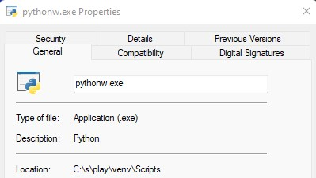

# play-mp3-in-loop

## About

* Some Bluetooth speaker turns off automatically after an interval e.g. 10 minutes to save the battery life.
* However, it is not convenient when the speaker used at home with a personal computer.
* Solution
  * To prevent the speaker from turning off automatically an audio file can be played with an interval.
  * The prevention still works if the audio is played with 0.00001% volume also.
  * Thus, playing an audio with an interval with almost no volume, solves the issue.

## Usage

```shell
$ python play.py -h

usage: play.py [-h] [-i INTERVAL] [-v VOLUME] path

Play an audio file with an interval.

positional arguments:
  path                  Path to the audio file.

options:
  -h, --help            show this help message and exit
  -i INTERVAL, --interval INTERVAL
                        Playing interval.
  -v VOLUME, --volume VOLUME
                        Volume of the audio.
```

### Examples

```shell
# Play audio.mp3 with the default interval and volume.
python play.py audio.mp3

# Play audio.mp3 with the default interval and 50% volume.
python play.py audio.mp3 -v 0.5

# Play audio.mp3 with an interval of 4 seconds and 90% volume.
python play.py audio.mp3 -i 4 -v 0.9
```

## How to Configure

* Create a directory in the OS and copy all the file in [src](src).
* Create a python virtual environment in that directory and install the requirements.
* Configure the file [play.bat](src/play.bat) with the python location.
  * Example: `START /MIN C:\s\play\venv\Scripts\pythonw C:\s\play\play.py C:\s\play\audio.mp3`
    * `START /MIN` is used to start a separate window to run a specified command.
    * `pythonw` is used to run the program in background.
* Add this file to the system startup.
  * Search for `run` and type `shell:startup`.
  * Paste a shortcut to the file here.

## How to Stop

* run `taskkill /F /IM pythonw.exe /T` or execute `stop.bat`.
  * Explanation: `taskkill /F {force} /IM {image name} {process name} /T {terminate}`
  * Notes
    * This will kill all the processes of `pythonw.exe`.
    * Not recommended if you are running multiple background applications.
* Go to `Task Manager > Details >`  `> End task`
* You can be sure if the location property is linked to the correct location.
> 

## How to Uninstall

* Remove the shortcut to the file `play.bat` from system startup.

## Useful Links

* [sound-volume-in-python](https://stackoverflow.com/questions/48337864/sound-volume-in-python)
* [command-line-arguments-with-argparse](https://towardsdatascience.com/a-simple-guide-to-command-line-arguments-with-argparse-6824c30ab1c3)
* [execute-a-windows-command-line-in-background](https://superuser.com/questions/198525/how-can-i-execute-a-windows-command-line-in-background)
* [run-python-in-background](https://stackoverflow.com/questions/9705982/pythonw-exe-or-python-exe)
* [kill-multiple-instances-of-an-app-in-windows](https://superuser.com/questions/1605191/how-to-kill-an-application-in-one-go-when-there-are-multiple-instances)
